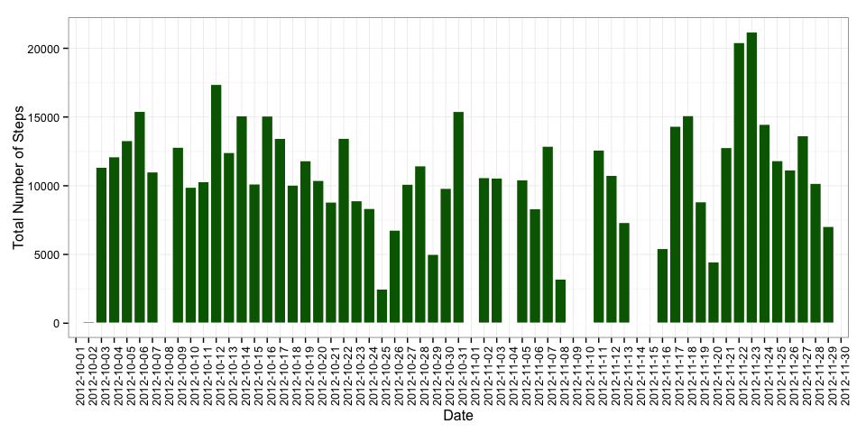

# Reproducible Research: Peer Assessment 1


## Loading and preprocessing the data

First, we will load up the data and packages and set up some defaults. 
I'll be using the dplyr and ggplot2 R packages.  
No additional processing is needed at this stage.


```r
knitr::opts_chunk$set(echo = TRUE)
library(dplyr)
library(ggplot2)
activity <- read.csv('activity.csv', stringsAsFactors=T)
```

## What is mean total number of steps taken per day?

To determine the total number of steps, we group by day and sum up each day. 
At this stage, we ignore missing values.  
The histogram display the total number of steps for each day.


```r
sumdata <- 
    activity %>%
    group_by(date) %>%
    summarize(sum=sum(steps, na.rm=T))

ggplot(sumdata, aes(date, sum)) + 
    geom_bar(fill='darkgreen', col='white', stat="identity") +
    labs(x='Date', y='Total Number of Steps') + 
    theme_bw() + 
    theme(axis.text.x = element_text(angle=90))
```

 

The mean and median of the total number of steps taken per day is as follows.


```r
mean(sumdata$sum)
median(sumdata$sum)
```

## What is the average daily activity pattern?


## Imputing missing values


## Are there differences in activity patterns between weekdays and weekends?
