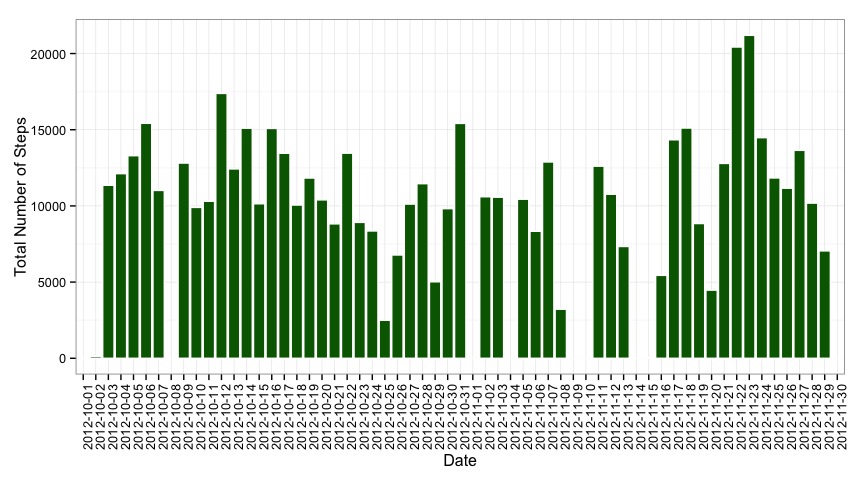
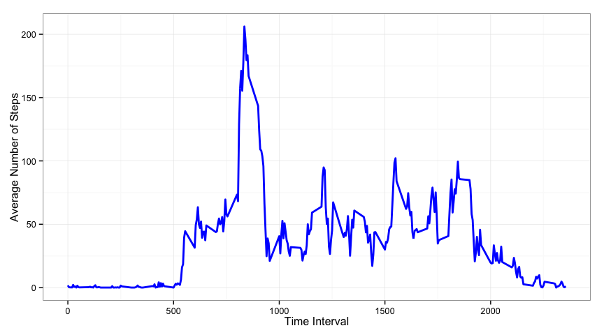
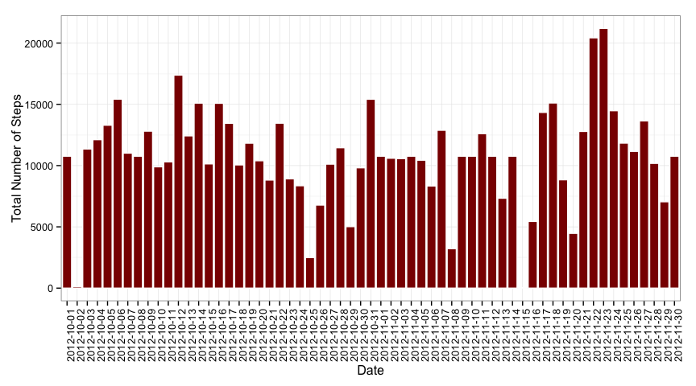
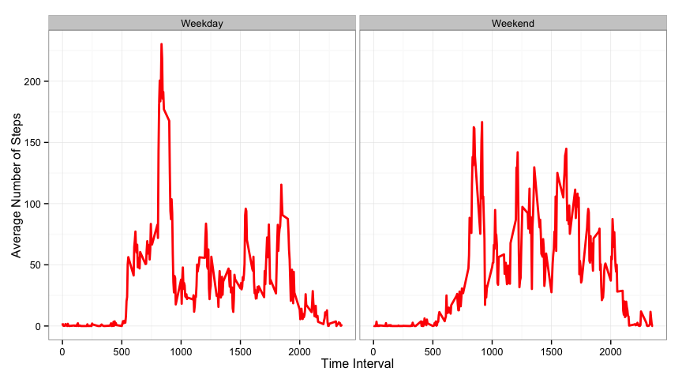

# Reproducible Research: Peer Assessment 1


## Loading and preprocessing the data

First, I will load up the data and packages and set up some defaults. 
I'll be using the dplyr and ggplot2 R packages.  
No additional processing is needed at this stage.


```r
knitr::opts_chunk$set(echo = TRUE)
library(dplyr)
library(ggplot2)
activity <- read.csv('activity.csv', stringsAsFactors=T)
```

## What is mean total number of steps taken per day?

To determine the total number of steps, I group by day and sum up each day. 
At this stage, I ignore missing values.  
The histogram display the total number of steps for each day.


```r
sumdata <- 
    activity %>%
    group_by(date) %>%
    summarize(sum=sum(steps, na.rm=T))

ggplot(sumdata, aes(date, sum)) + 
    geom_bar(fill='darkgreen', col='white', stat="identity") +
    labs(x='Date', y='Total Number of Steps') + 
    theme_bw() + 
    theme(axis.text.x = element_text(angle=90))
```

 

The mean and median of the total number of steps taken per day is as follows.


```r
mean(sumdata$sum)
```

```
## [1] 9354.23
```

```r
median(sumdata$sum)
```

```
## [1] 10395
```

## What is the average daily activity pattern?

To examine the daily averages, I group by time interval measured and then take 
mean of the number of steps. 
The plot shows the average number of steps for each interval.


```r
interval5 <-
    activity %>%
    mutate(interval=as.factor(interval)) %>%
    group_by(interval) %>%
    summarize(mean=mean(steps, na.rm=T)) %>%
    mutate(interval=as.integer(as.character(interval)))


ggplot(interval5, aes(x=interval, y=mean)) +
    geom_line(col='blue', size=1) + 
    labs(x='Time Interval', y='Average Number of Steps') + 
    theme_bw()
```

 

The interval at which the maximum number of steps happens can be readily found as follows:


```r
interval5 %>%
    filter(mean==max(mean, na.rm=T)) %>%
    select(interval, mean)
```

```
## Source: local data frame [1 x 2]
## 
##   interval     mean
## 1      835 206.1698
```

## Imputing missing values

There are various ways to impute the missing values. 
First, I'll find out how many values are missing.


```r
activity %>%
    filter(is.na(steps)) %>%
    summarize(countNA=n())
```

```
##   countNA
## 1    2304
```

I will be replacing missing values with the average of those in the same time interval. 
This uses the data frame created in the prior step where I calculated this average number of steps over each time interval.


```r
newactivity <- activity
for(i in seq_along(newactivity$steps)) {
    if(is.na(newactivity$steps[i])) {
        indexarray <- interval5$interval == newactivity$interval[i]
        newactivity$steps[i] <- interval5$mean[indexarray]
    }
}

sumdata2 <- 
    newactivity %>%
    group_by(date) %>%
    summarize(sum=sum(steps))
```

The following histogram displays the total number of steps per day and should be compared with the first histogram.


```r
ggplot(sumdata2, aes(date, sum)) + 
    geom_bar(fill='darkred', col='white', stat="identity") +
    labs(x='Date', y='Total Number of Steps') + 
    theme_bw() + 
    theme(axis.text.x = element_text(angle=90))
```

 

As before, the mean and median can be readily calculated:


```r
mean(sumdata2$sum)
```

```
## [1] 10766.19
```

```r
median(sumdata2$sum)
```

```
## [1] 10766.19
```

These averages differ from the prior estimates. 
The cause for this can be idendified when comparing the daily sums between the original data frame and the one with imputed values:


```r
sumdata2$sum - sumdata$sum
```

```
##  [1] 10766.19     0.00     0.00     0.00     0.00     0.00     0.00
##  [8] 10766.19     0.00     0.00     0.00     0.00     0.00     0.00
## [15]     0.00     0.00     0.00     0.00     0.00     0.00     0.00
## [22]     0.00     0.00     0.00     0.00     0.00     0.00     0.00
## [29]     0.00     0.00     0.00 10766.19     0.00     0.00 10766.19
## [36]     0.00     0.00     0.00     0.00 10766.19 10766.19     0.00
## [43]     0.00     0.00 10766.19     0.00     0.00     0.00     0.00
## [50]     0.00     0.00     0.00     0.00     0.00     0.00     0.00
## [57]     0.00     0.00     0.00     0.00 10766.19
```

The missing values correspond to entire days. 
Each of these days is replaced by what is effectively an "average day" created by having averaged the number of steps in each time interval.
Because this happens several times, the end result is that it skews the average and median strongly towards this average day.

## Are there differences in activity patterns between weekdays and weekends?

To examine the differences in activity patterns between weekdays and weekends, I will generate a few extra columns denoting the day of the week and a factor that denotes weekday/weekend.
I will the data frame created in the prior step which has missing values imputed.


```r
newactivity2 <- 
    newactivity %>%
    mutate(dayofweek = weekdays(as.POSIXct(date))) %>%
    mutate(typeofday = factor(dayofweek %in% c('Sunday','Saturday'), 
                              levels=c(F,T), labels=c('Weekday','Weekend')))

interval5 <-
    newactivity2 %>%
    mutate(interval=as.factor(interval)) %>%
    group_by(typeofday, interval) %>%
    summarize(mean=mean(steps, na.rm=T)) %>%
    mutate(interval=as.integer(as.character(interval)))
```

The following plot illustrates this.


```r
ggplot(interval5, aes(interval, mean)) +
    facet_grid(. ~ typeofday) +
    geom_line(col='red', size=1) + 
    labs(x='Time Interval', y='Average Number of Steps') + 
    theme_bw()
```

 


